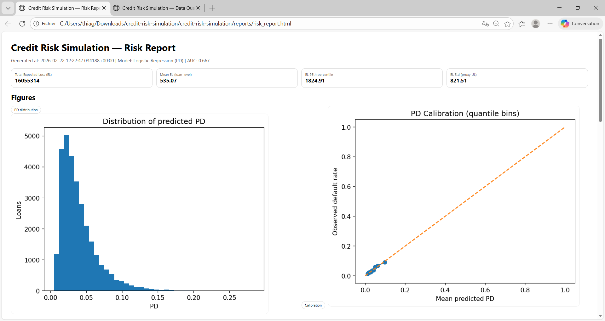
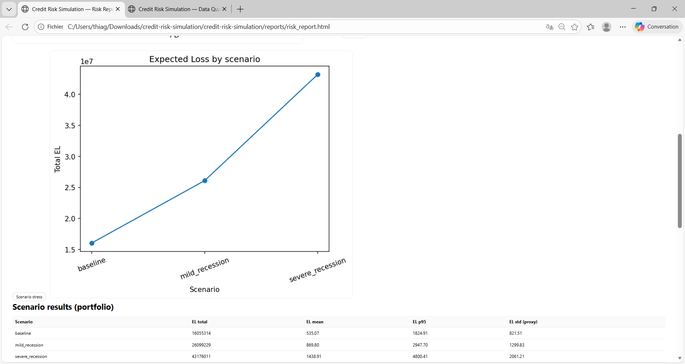
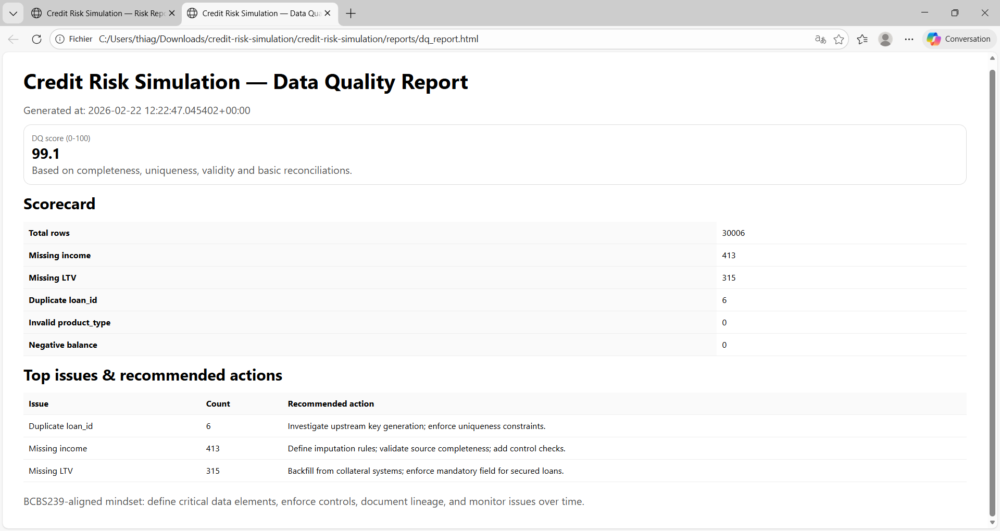

# 🚀 Credit Risk Simulation (PD / LGD / EAD)

End-to-end **credit risk analytics pipeline** combining modeling, data quality, and reporting.

---

## 🎯 Business Objective

Simulate a credit portfolio and deliver **reliable, explainable risk metrics** to support:

* Risk management decisions
* Capital estimation logic
* Data governance and quality control

---

## 🧩 Key Features

* 📊 **Probability of Default (PD)** modeling (Logistic Regression, AUC, calibration)
* 💸 **LGD & EAD estimation** (transparent, explainable approach)
* ⚠️ **Expected Loss (EL)** computation at portfolio level
* 🌍 **Macro stress testing scenarios** (baseline, mild, severe recession)
* 🧪 **Data Quality framework** (completeness, validity, reconciliation)
* 📈 **Management-ready reporting** (HTML dashboards)

---

## 📸 Outputs

### Risk Overview



### Stress Testing



### Data Quality



---

## ⚙️ Quickstart

```bash
python -m venv .venv
.venv\Scripts\activate   # Windows
pip install -r requirements.txt

python -m src.crsim.report
```

Outputs:

* `reports/risk_report.html`
* `reports/dq_report.html`

---

## 🧠 What this project demonstrates

* Strong analytical mindset applied to **credit risk modeling**
* Ability to build **end-to-end data pipelines**
* Understanding of **data governance & BCBS239 principles**
* Capability to deliver **business-ready insights from raw data**

---

## 🏗️ Architecture

```
Raw Data → Feature Engineering → PD Model → LGD/EAD → Expected Loss → Reporting
                         ↓
                  Data Quality Checks
```

---

## 📁 Repository Structure

* `src/crsim/` — core Python modules
* `sql/` — schema, transformations, data quality queries
* `reports/` — generated reports
* `data/synthetic/` — synthetic dataset

---

## ⚠️ Disclaimer

This is a **simulation project** designed to demonstrate credit risk analytics and data governance concepts.
It is not a regulatory IRB model.

---

## 🎯 Why this project

This project reflects my ability to work at the intersection of:

* Data engineering
* Risk analytics
* Business decision-making

With a strong focus on **data quality, transparency, and impact**.
